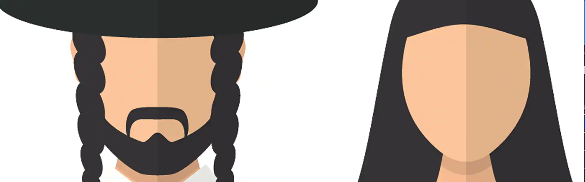

# Hasidic Developers Group - `< hdg />`

- [What We Do](#what-we-do)
- [Top Repos](#top-repos)
- [Available Teams](#available-teams)
- [Communicate With Us](#communications-with-the-team)

## What We Do...

Mainly we build websites, discord bots, and design logos. We are a small group of developers who network and communicate on Discord. If you are interested in joining our teams or contributing to any of our projects, please read the CONTRIBUTING doc in `hasidicdevs/Docs/` at this time we do not accept contributions from outside our group. We have a couple npm packages and we run a website. This is a simple profile readme and is updated as we grow. Our main website is https://hasidic.dev it is owned by @yosileyid and most of the work done so far has been done by him. We are looking for more jewish developers whether new or old to get involved with this project. 

## Top Repos

- [@hdg-bot](https://github.com/hasidicdevs/hdg-bot): This is a simple npm package to facilitate creating new discord bots.
- [@hdg/docs](https://github.com/hasidicdevs/Docs): Org documentation
- [@hdg/web](https://github.com/hasidicdevs/website): Org website
- [@hdg/discussions](https://github.com/orgs/hasidicdevs/discussions): Org Discussions (Public)

## Available Teams
- @hasidicdevs/web
- @hasidicdevs/bots
- @hasidicdevs/graphics
- @hasidicdevs/api

## Communications With The Team

- [[Discord Server: HDG Support]](https://discord.com/invite/mWepccFCQh)
- [[HDG Forums: @hasidicdevs/Discussions]](https://github.com/orgs/hasidicdevs/Discussions)
- [[Bot Boards: @hasidicdevs/hdg-bot]](https://github.com/orgs/hasidicdevs/projects/4)
- [[Web Boards: @hasidicdevs/hdg-web]](https://github.com/orgs/hasidicdevs/projects/2)

### LICENSE

We use the Mozilla Public License v2.0 in our projects. 